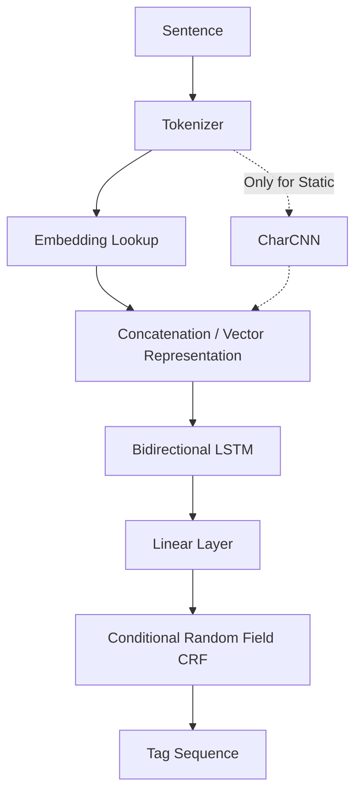

# Biomedical Named Entity Recognition (NER) Benchmarking

This repository contains the benchmarking results of 15 natural language processing (NLP) pipeline configurations engineered for biomedical Named Entity Recognition (NER). The project evaluates five word representation methods across three tokenization strategies using the standard BC5CDR dataset annotated with disease entities (`B-Disease`, `I-Disease`, `O`).

---

## System Architecture

All configurations utilize a standardized sequence extraction backbone consisting of a Bidirectional LSTM and a Conditional Random Field (CRF) classification layer:

1. **Static Embeddings (Word2Vec, GloVe, FastText):** Utilizes a hybrid **CharCNN + BiLSTM + CRF** architecture. A character-level 1D Convolutional Neural Network extracts morphological features (prefixes/suffixes) to handle out-of-vocabulary (OOV) terms, which are concatenated with the word embeddings.
2. **Contextual Embeddings (ELMo):** Extracted deep contextual features are fed directly into a sequence-modeling **BiLSTM + CRF** framework.
3. **Fine-tuned Transformer (PubMedBERT):** Fine-tuned natively with a custom layer-wise learning rate decay (LLRD) and Automatic Mixed Precision (AMP), coupled with a downstream **BiLSTM + CRF** classifier.



---

## Benchmarking Results

The table below logs the macro-averaged Test F1-scores achieved across all 15 pipeline combinations on the disease entity boundaries:

| Embedding Method | Tokenization Method | Test F1-Score |
| :--- | :--- | :---: |
| **PubMedBERT** | Whitespace | **0.8533** |
| **PubMedBERT** | NLTK | 0.8417 |
| **PubMedBERT** | BPE / WordPiece | 0.7969 |
| **ELMo** | Whitespace | 0.7965 |
| **ELMo** | NLTK | 0.7864 |
| **GloVe (100d)** | Whitespace | 0.7746 |
| **FastText (100d)** | Whitespace | 0.7578 |
| **Word2Vec (100d)** | Whitespace | 0.7470 |
| **GloVe (100d)** | NLTK | 0.7414 |
| **ELMo** | BPE / WordPiece | 0.7392 |
| **FastText (100d)** | NLTK | 0.7321 |
| **Word2Vec (100d)** | NLTK | 0.7201 |
| **GloVe (100d)** | BPE / WordPiece | 0.7190 |
| **FastText (100d)** | BPE / WordPiece | 0.7086 |
| **Word2Vec (100d)** | BPE / WordPiece | 0.6996 |

---

## Key Findings

* **Domain-Specific Pre-training:** PubMedBERT outperformed all other embedding layers. Language models pre-trained natively on medical abstracts capture specialized clinical nomenclature far better than models exposed only to general text.
* **Contextual vs. Static Embeddings:** Contextual embeddings (ELMo & PubMedBERT) regularly surpassed static vectors (GloVe, FastText, Word2Vec). Modeling words dynamically based on their sentence-level context resolves semantic variations in complex medical text.
* **The Tokenizer Fragmentation Penalty:** Across all five embedding styles, the BPE/WordPiece subword tokenizer consistently degraded performance. While subword splitting manages vocabulary size, it fragments technical clinical terms. This creates artificial boundaries that disrupt the sequence transition scoring of the downstream CRF layer.

---

## Advanced Transformer Optimization

To fine-tune PubMedBERT efficiently without destabilizing pre-trained weights, two techniques were implemented:

1. **Automatic Mixed Precision (AMP):** Utilizes `torch.cuda.amp.autocast` scaling to speed up GPU execution and reduce memory overhead by running calculations in half-precision (`float16`) without losing model accuracy.
2. **Layer-wise Learning Rate Decay (LLRD):** Applies an exponential decay factor ($\gamma = 0.95$) down through the transformer layers. Deeper layers adapt actively to the specific classification task, while early layers preserve foundational language features.

---

## Execution Instructions

### Installation
Install the required packages in a Python 3.10+ environment with GPU support:
```bash
pip install numpy==1.26.4 scipy==1.12.0 gdown transformers datasets seqeval gensim torch pytorch-crf tensorflow tensorflow-hub nltk
```

### Running the Notebook
Open `Code.ipynb` in a Jupyter Notebook environment (e.g., Kaggle, Colab, or local VS Code) and execute the cells sequentially. The notebook handles dataset download, token alignment, pipeline training, and evaluation automatically.
